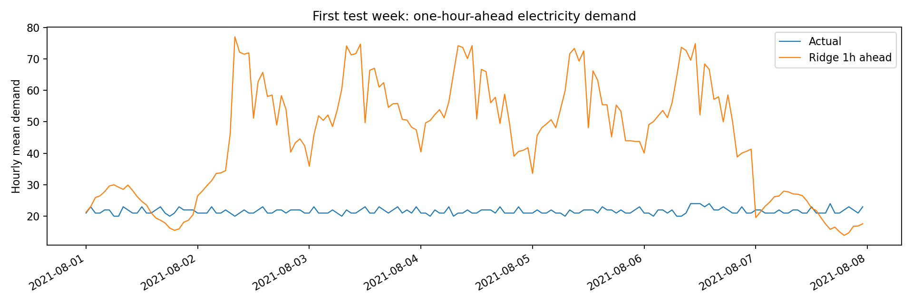

# 5번 데이터셋: 첫 예측 결과

## 현재 질문

**직전 시간이 끝났을 때 다음 1시간의 평균 전력사용량을 얼마나 정확히 예측할 수 있는가?** 예측 시점에 아직 알 수 없는 해당 시간의 `15분`·`30분`·`45분`·`60분` 값, 실제 생산량과 실제 날씨는 입력에서 제외했습니다. 과거 전력·생산량과 달력 정보만 사용했습니다.

## 데이터 진단

- 총 6,168행, 2021년 1월 1일–9월 14일 시간별 기록입니다.
- 2021년 7월 13일과 15일은 `시간` 값이 24–188로 손상된 48행입니다. 실제 시각을 확인할 근거가 없어 해당 날짜 전체를 제외했습니다.
- 남은 데이터에는 풍속 결측 3개, 강수량 결측 1개가 있지만, 이번 모델은 두 변수를 사용하지 않습니다.
- `평균`은 같은 행의 네 15분 전력값의 평균에서 최대 0.5만큼 차이 납니다. 네 값을 입력하면 미래 정답 누출이므로 사용하지 않았습니다.
- 학습 4,176시간(1–6월), 검증 600시간(7월), 시험 1,080시간(8월–9월 14일)입니다. 최근 168시간 관측이 필요한 구간과 손상된 날짜 주변 구간은 빠집니다.

## 시험 성능

| 모델 | 평균 절대오차(MAE) | RMSE | 피크 정밀도 | 피크 재현율 |
|---|---:|---:|---:|---:|
| 직전 시간 지속성 | **13.27** | 23.35 | 0.47 | **0.47** |
| 1주 전 같은 시간 | 31.52 | 58.81 | 0.31 | 0.37 |
| 과거 전력·생산량·달력 릿지 회귀 | 15.75 | **22.31** | **0.56** | 0.36 |

피크는 학습 기간 전력의 95백분위인 173 이상으로 정의했습니다. 시험 기간 피크 112시간 중 지속성 기준이 53시간, 릿지가 40시간을 찾았습니다. 릿지는 오경보가 31건으로 지속성의 59건보다 적지만, 미탐지가 72건으로 더 많습니다. 어떤 모델이 더 적합한지는 피크 미탐지와 오경보 비용을 정한 뒤 판단해야 합니다.

검증 기간에는 1주 전 같은 시간 기준의 MAE가 약 7.04로 좋았지만 시험 기간에는 31.52로 크게 나빠졌습니다. **8월 1–7일은 생산량이 전 시간 0이고 전력은 20–24 수준**인데, 1주 전 값이나 릿지 모델은 그 이전의 가동 패턴을 이어 예측합니다. 즉, 예정된 장기 휴업 여부가 예측 시점에 알려져 있다면 중요한 입력이지만 현재 파일에는 별도 일정표가 없습니다. 7월의 주간 패턴이 8–9월에도 유지된다고 가정하면 위험합니다.

릿지 모델의 시험 MAE는 주말 7.22, 평일 19.21입니다. 실제 피크 시간의 MAE는 26.45로 비피크 14.51보다 큽니다. 특히 8시의 MAE가 약 40.64, 12시가 약 31.63입니다. 가동 시작·점심·작업 전환 시각의 변화가 오차에 영향을 주는지 확인할 필요가 있습니다. 이 해석은 아직 원인 확인 전의 가설입니다.

## 다음 발전 방향

1. 정확한 예측 시간 구간과 운영상 피크 비용을 정합니다. 현재 1시간 앞 예측은 첫 실험의 명시적 가정입니다.
2. 평일 가동 시작과 생산 전환을 구분하는 특징을 추가하고, 검증 기간 여러 구간에서 비교합니다. 예정 휴업일 정보가 실제 운영에서 제공되는지도 확인해야 합니다. 시험 기간에서 휴업 구간을 발견했으므로 그 정보를 이용해 시험 점수를 다시 맞추는 일은 피합니다.
3. 회귀와 별도로 피크 경보 기준을 조정하고, 피크 미탐지·오경보 비용을 수치화합니다.
4. 생산일정 변경을 제안하려면 시간별 예정 생산량과 설비별 소비전력이 필요합니다. 현재 데이터에서는 운영 시나리오의 가정을 분명히 표시하고, 인과 효과를 단정하지 않습니다.
5. 재현 가능한 코드·보고서·영어 수업 발표를 준비합니다. 수업 제출 시 코드와 결과를 직접 실행·검증하고 모든 판단을 설명할 수 있어야 합니다.
