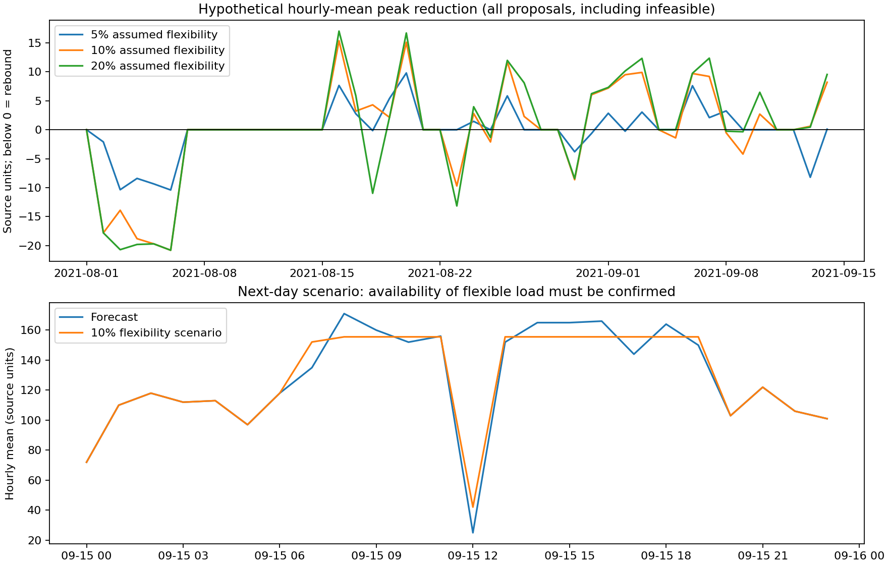

# 경진대회 ⑤: 피크 위험조건과 운영 조정 제안

18차에서는 예측을 생산일정·설비 가동 조정에 어떻게 연결할지 검토했다. 현재 하루 예측만으로 자동 조정할 근거는 부족하다. 부하 이동을 수학적으로 최적화해도 예측오차와 실제 이동 가능량 때문에 기대 효과가 사라질 수 있다는 것을 데이터로 확인했다. 따라서 현장 제안은 **하루 전 후보 계획 → 확정 작업·설비 제약 확인 → 한 시간 전 재점검 → 담당자 결정 → 시행 후 측정** 순서다.

## 1. 과제 요구에 대한 16~18차의 보강

| 원문 요구 | 이번 보강 | 현재 결론 |
|---|---|---|
| 지정 시간구간 전력 예측 | 같은 관측 종료 시점에서 다음 24시간을 동시에 예측하는 코드와 검증 추가 | 한 시간 평균 예측은 MAE 4.904 유지. 하루 계획용은 전주 기준 선택, MAE 31.521로 불확실성이 큼 |
| 큰 오차의 생산조건 | 가동 점수와 전문가 혼합으로 시작·종료 오류를 보정하는 6개 후보 시험 | 전체 오차 제한과 7월 전환 개선 조건을 통과하지 못해 기존 모델 유지 |
| 최대피크 주요 조건 | 시간·요일·직전 생산상태·실제 생산상태별 표본수와 발생률, 연속 피크 사건의 시작 경보 분석 | 공정 원인이 아닌 관측 연관성으로 제시 |
| 일정·설비 가동 조정 | 이동량·시간거리·운영시간·수신 한도를 둔 부하 이동 시나리오 구현 | 모의 예측 효과와 관측 부하 적용 결과의 차이가 큼. 실제 설비 계획으로 타당성 확인 필요 |

공식 예측 구간·전력 단위·계약상 최대수요전력 산식은 제공 파일에서 확정할 수 없다. 시간 평균 피크와 15분 최대 피크를 구분한다. 이 문서의 숫자에 임의로 kW·kWh·원 단위를 붙이지 않는다.

## 2. 어떤 조건에서 피크가 많았나

2021년 8월 1일~9월 14일, 1,080시간 중 네 15분 값의 최대가 182 이상인 시간은 123개였다. 아래는 이 기간의 연관성이며 다른 기간의 확률이나 설비 운전의 인과효과가 아니다.

| 조건 | 조건을 만족한 시간 | 피크 시간 | 관찰 발생률 | 알 수 있는 시점 |
|---|---:|---:|---:|---|
| 11시 | 45 | 20 | 44.4% | 하루 전 달력 |
| 08시 | 45 | 18 | 40.0% | 하루 전 달력 |
| 14시 | 45 | 17 | 37.8% | 하루 전 달력 |
| 직전 생산량 양수 | 616 | 121 | 19.6% | 직전 시간 관측 완료 후 |
| 직전 생산량 0 | 464 | 2 | 0.4% | 직전 시간 관측 완료 후 |
| 실제 생산량 양수 지속 | 588 | 121 | 20.6% | 해당 시간 종료 후 사후 진단 |
| 실제 생산 시작 | 29 | 2 | 6.9% | 해당 시간 종료 후 사후 진단 |

토·일요일 312시간에는 이 기준의 피크가 없었다. 평일·주간에 집중됐지만 **주말 가동이 안전하다거나 작업을 주말로 옮겨도 된다는 뜻은 아니다.** 휴업·교대·설비 제약을 모르는 상태다. 실제 생산 시작은 피크 빈도보다 평균 예측 오차가 큰 문제로 나타났으므로, ‘큰 오차’와 ‘피크 위험’을 동일하게 취급하지 않는다.

연속된 피크 시간을 한 사건으로 묶으면 **59건**이다. 유지한 한 시간 경보는 이 중 **54건의 첫 시간에 경보**를 냈다. 직전 시간 관측 직후 즉시 예측할 수 있다는 가정하의 결과다. 피크 시간별 적중 116/123과 사건 시작 경보 54/59는 서로 다른 지표다. 한 시간 경보 전체에는 오경보 126시간이 있으므로 실제 담당자 처리 부담도 측정해야 한다.

## 3. 부하 이동 모의 실험의 가정과 제약

`operations.py`는 하루 예측을 먼저 고정하고 선형계획으로 이동량을 결정한다. 예측한 각 시간 부하에서 일부를 다른 시간으로 옮길 수 있다고 가정한다. 이 데이터에는 실제 이동 가능한 설비·작업이 없으므로 다음 조건은 **시험용 가정**이다.

- 이동 가능 비율: 0·5·10·20%의 네 시나리오를 모두 공개.
- 원래 시간에서 앞뒤 최대 2시간까지만 이동하며, 당일 07~19시 안에서 이동.
- 각 시간에서 내보낼 수 있는 양은 그 시간 예측값의 해당 비율 이하.
- 한 시간에 받을 수 있는 총량은 그날 예측 최대값의 10% 이하.
- 전체 시간 부하 합을 보존하고 음수가 되지 않도록 제한.
- 예측한 시간 평균의 하루 최대를 최소화한 뒤, 같은 최대값이면 이동량이 가장 작은 계획 선택.

이동량을 연속적으로 나눌 수 있고 설비가 지시대로 반응한다는 가정이다. 부하 합 보존은 **생산량·납기·제품 품질 보존을 뜻하지 않는다.** 실제 작업의 최소 연속 가동 시간, 선후 공정, 재기동 손실, 설비별 정격, 작업자의 근무 가능 시간은 이 CSV로 확인할 수 없다. 시간 평균 최적화 결과를 15분 계약 최대수요전력 절감량으로 바꾸지 않는다.

## 4. 예측상 효과와 관측 부하에 적용한 모의 결과

45일의 매일 자정 예측으로 이동을 먼저 결정한 뒤, 실제 관측 부하에 **같은 이동량을 그대로 적용**했다. 실제 관측값으로 이동계획을 다시 고르지 않았다. 적용식은 `실제 부하 − 계획 유출 + 계획 유입`으로, 인과적으로 검증된 시행 후 부하가 아니다. 실제 부하의 가정된 이동 가능 비율보다 유출이 큰지도 사후 점검했다.

| 가정 이동 가능 비율 | 예측상 일별 최대 감소 평균 | 모든 제안의 산술적 모의 감소 평균 | 가정 이동 한도 위반 일수 | 모의 피크 반등 일수 |
|---|---:|---:|---:|---:|
| 0% | 0.000 | 0.000 | 0/45 | 0/45 |
| 5% | 5.771 | **−0.040** | 23/45 | 10/45 |
| 10% | 10.713 | **0.055** | 24/45 | 11/45 |
| 20% | 12.689 | **0.158** | 6/45 | 11/45 |

수치는 CSV 원래 부하 단위다. 음수 감소량은 증가를 뜻한다. 모든 제안 열에는 한도를 위반한 실행 불가능한 가정 사례도 포함하므로 **달성 가능한 효과의 추정치가 아니다.** 실패 크기를 공개하는 진단이다. 한도 충족 여부도 이 비율 가정 하나에 대한 판정이며 실제 작업 실행 가능성의 보증이 아니다.

10% 시나리오에서는 한도를 충족한 21일만 보아도 하루 최대의 모의 감소 평균이 1.160이었다. 이동안이 생성된 32일 중 한도를 충족한 날은 8일이며 그 8일의 모의 감소 평균은 3.044다. 나머지 13일은 이동이 전혀 없어 전체 21일의 평균에 포함된다. `summary.json`에 이러한 분모와 부분집합을 모두 기록했다. 한도 충족 날짜만 사후 선택한 성적을 실제 운영 성과로 주장하지 않는다. 20% 시나리오도 한도를 만족한 날짜 중 6일에서 피크가 반등했다.

왜 이런 차이가 생기는가: 예측이 피크라고 본 시간이 실제 피크와 다르면, 부하를 받은 시간이 새로운 피크가 될 수 있다. 8월 첫 주처럼 저부하인데 전주 가동 모양을 예측하면 실제로 존재하지 않는 이동 가능 부하를 계획하게 된다. 따라서 예측 오차와 현장 제약 확인이 운영 최적화의 전제다.

## 5. 현장에서 검토할 절차와 보류 조건

| 시점 | 담당자가 확인할 것 | 필요한 데이터 | 조정 보류 조건 |
|---|---|---|---|
| 하루 전 | 24시간 예측의 높은 시간대와 실제 확정 생산계획을 대조 | 계획 확정 시각, 작업·설비 식별자, 예정 시작·종료, 휴업·정비 | 계획이 없거나 변경 중이면 이동안 확정 보류 |
| 일정 후보 검토 | 기동 분산·유연 작업 이동이 가능한지 확인 | 설비별 부하, 이동 가능 작업, 최소 가동시간, 선후 관계, 납기·생산 의무 | 작업 분할·시간 이동이 불가능하거나 생산 제약을 위반하면 제외 |
| 한 시간 전 | 최신 관측으로 한 시간 예측·피크 경보·경험적 범위를 갱신 | 최신 네 15분 값, 생산량, 최신 작업 상태 | 경보와 실제 계획이 어긋나거나 수신 시간의 여유를 확인할 수 없으면 재검토 |
| 시행 결정 | 이동 전후 계획의 15분 단위 피크·제약을 확인하고 담당자가 승인 | 계약 피크 정의, 15분 설비 부하, 현장 운전 기준 | 시간 평균만으로 15분 피크를 판단해야 하면 절감 효과 확정 보류 |
| 시행 후 | 예상·실제 피크, 생산량·납기·품질, 경보 대응 기록 | 변경 로그, 계측값, 제품·작업 결과 | 제약 위반이나 반등 시 해당 조정안 중단·원인 점검 |

현재 코드가 실제 공장에 변경을 보내지는 않는다. 다음 단계는 현장 계획을 받아 작업별 실행 가능성을 검증하고, 아직 보지 않은 기간에서 먼저 계획만 생성해 관측과 비교하는 것이다. 시행 효과를 평가할 때는 생산량·제품·휴업 조건이 다른 날을 단순 비교하지 않고, 비교 가능한 기간과 생산 제약을 사전에 정한다. 전기료 절감액 계산은 단위·요금·계약 기준과 실제 시행 효과를 확인한 후에 가능하다.

## 6. 산출물과 실행

`python3 horizon.py`로 하루 예측을 생성한 뒤 `python3 operations.py`를 실행한다. 이미 저장된 예측을 쓰면 두 번째 명령만 실행해도 된다.

- [조건·시나리오 요약](outputs/stage18/summary.json): 입력·예측 파일 검증값, 가정, 피크 조건, 사건 시작 경보와 시나리오 지표.
- [날짜별 시나리오](outputs/stage18/daily_scenarios.csv): 가정별 최대값·제약 위반·이동량·반등.
- [시간별 시나리오](outputs/stage18/hourly_scenarios.csv), [이동 내역](outputs/stage18/load_transfers.csv): 계획을 검토할 수 있는 구체적인 양과 시간.
- [다음 날 시나리오](outputs/stage18/next_day_scenarios.csv): 정답 없는 9월 15일의 가정별 계획. `unmodified_plan_*` 피크 정보는 이동 전 예측으로, 이동 후 15분 피크를 의미하지 않는다.
- [다음 날 이동 내역](outputs/stage18/next_day_transfers.csv): 가정별 출발·도착 시간과 이동량. 현장 확인 전 시나리오라는 상태를 함께 표시한다.

