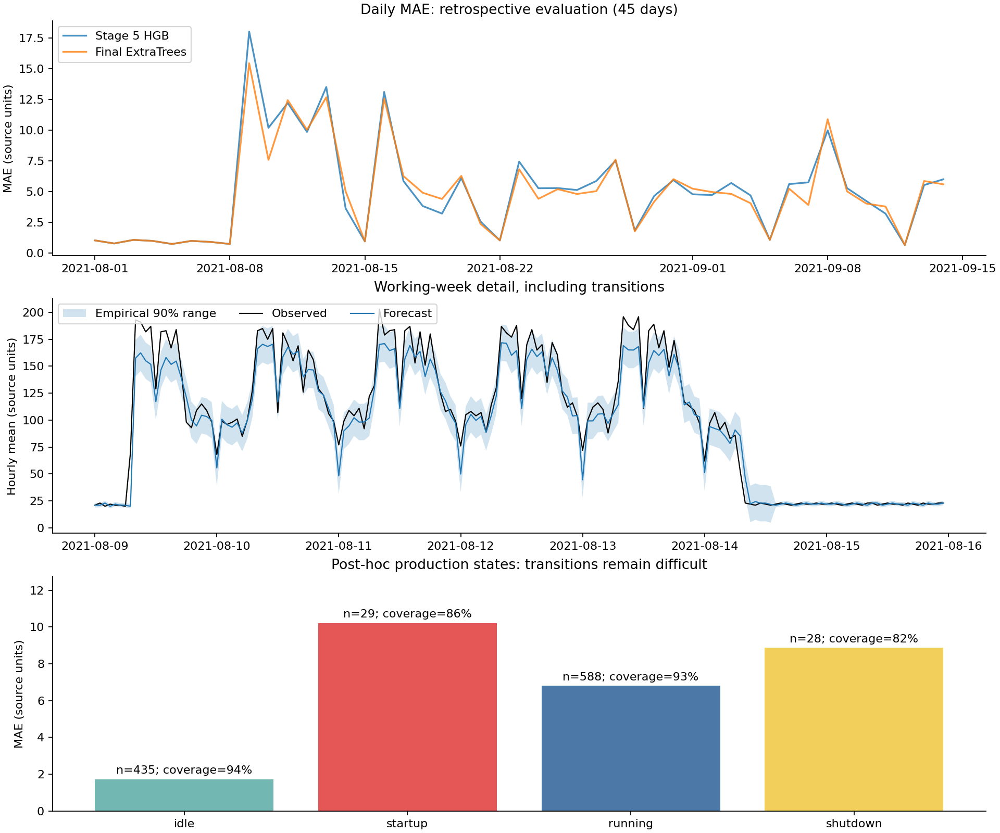

# ⑤ 자원 최적화: 15차 최종 분석

## 1. 채택한 구성

다음 1시간 평균 전력 예측은 **ExtraTrees 240개 트리·최소 잎 표본 2 + 과거 저부하 지속성 규칙**을 채택했다. 55개 입력은 과거 전력·생산량·15분 전력 모양·가동 이력·달력이다. 전체 학습 이력을 사용하며 평가 중 9월 초에 평균 모델을 재학습한다. 후보 선택은 4~6월 월별 MAE 평균으로 고정했다.

피크는 별도 분류한다. 신규 분류기와 최근 월 보정은 미탐이 늘어 **4차 경보 정책을 유지**했다. 평균 예측 범위는 과거 저부하 여부에 따라 보정한다. 15차는 이 구성의 실제 추론과 실패 진단을 완성한 단계이며 추가적인 평균 점수 향상을 주장하지 않는다.

## 2. 성능과 개선의 불확실성

평가: 2021-08-01~09-14, 1,080시간. MAE·RMSE는 단위가 확인되지 않은 CSV 원래 수치 단위다.

| 모델 | MAE | 비고 |
|---|---:|---|
| 직전 시간 값 유지 | 13.273 | 기준 모델 |
| 2차 HGB 결합 | 6.588 | 고정 모델 |
| 3차 저부하 규칙 | 5.153 | 가동 이력 활용 |
| 5차 월별 재학습 | 5.067 | 이번 추가 실험의 비교 기준 |
| 9차 추가 특징 | 5.103 | 검증 개선이 이 기간에는 재현되지 않음 |
| 10~15차 선택 모델 | **4.904** | RMSE 8.526, WAPE 5.59% |

5차 대비 MAE **3.21% 감소**, 단순 지속성 대비 **63.05% 감소**다. 8월 MAE 5.013, 9월 4.663이다. 낮은 부하가 이어지는 8월 첫 주를 제외하면 MAE **5.634**로 전체 수치보다 어렵다.

45일을 7일 단위의 원형 블록으로 2,000번 재표본추출했다. 5차 대비 MAE 감소량은 0.163, 95% 백분위 구간은 **−0.069~0.411**이다. 0을 포함하므로 안정적인 우위가 입증됐다고 단정할 수 없다. 지속성 대비 감소량은 8.369, 구간은 5.583~10.652다. 이 계산도 반복 개발에 사용한 기간에 조건부이며 모델 선택 편향을 제거하지 않는다.

## 3. 채택하지 않은 변경

- **11차 결합:** HGB와 ExtraTrees 비율 0·25·50·75·100%에서 ExtraTrees 100%가 선택됐다.
- **12차 피크:** 풍부한 특징의 검증 평균 정밀도(AP)는 개선됐지만 평가 경보의 미탐은 7→28시간으로 늘었다.
- **13차 학습 이력:** 최근 28·56·84일보다 전체 이력이 검증에서 좋았다.
- **14차 피크 보정:** 같은 모델로 직전 월 보정·다음 월 평가를 수행해도 미탐이 44시간으로 늘었다.

실험 차수를 성능 향상 횟수로 해석하지 않는다. 후보별 검증 예측·선택 기록과 실패 결과를 모두 남겼다.

## 4. 예측 범위의 개선과 실패

8월 범위는 7월 예측 오차, 9월 범위는 8월 예측 오차로 계산했다. 저부하는 **이전 6시간 생산량 0이고 직전 평균 전력 25 이하**인지로 판정하므로 예측 당시 알 수 있다. 상태별 표본이 30개 미만이면 전체 반폭을 사용한다.

| 보정 | 실제 포함률 | 평균 폭 | 90% 구간 점수 ↓ |
|---|---:|---:|---:|
| 전체 잔차 | 92.22% | 28.36 | 42.92 |
| 과거 상태별 잔차 | **92.87%** | **23.40** | **37.04** |

폭이 약 **17.5%** 줄었다. 저부하가 아닌 681시간에서는 포함률 88.84→92.36%, 폭 28.59→34.81로 둘 다 늘었다. 이 집단의 구간 점수는 47.35→48.61로 나빠졌다. 모든 상태가 개선됐다고 해석하지 않는다.

90%는 목표 수준이며 미래 포함률 보장이 아니다. 최종 저장 모델은 마지막 관측 월에서 최소 48개 시간순 예측 잔차를 확보한 기간을 사용한다. 재학습 후에도 잔차는 해당 월을 사전에 예측했던 모델의 오차이며 학습 잔차로 대체하지 않는다.

## 5. 가동 조건별 실패

상태는 실제 해당 시간 생산량과 직전 생산량의 양수 여부로 정의했다. **사후 진단용이며 예측 입력으로 사용하지 않는다.** 생산량 양수가 실제 설비 전체의 가동을 뜻하는지는 추가 확인이 필요하다.

| 관측 상태 | 시간 수 | MAE | 절대오차 95백분위 | 범위 포함률 |
|---|---:|---:|---:|---:|
| 연속 생산량 0 | 435 | 1.726 | 4.82 | 94.48% |
| 생산 시작 | 29 | **10.212** | 38.80 | **86.21%** |
| 연속 생산량 양수 | 588 | 6.805 | 19.53 | 92.52% |
| 생산 종료 | 28 | **8.865** | 23.17 | **82.14%** |

생산 전환이 취약하다. 시작·종료 각각 표본이 30개 미만이라 작은 차이를 일반화하기 어렵다.

- **9월 8일 12시:** 실제 25, 예측 109.53, 오차 84.53. 생산량은 양수지만 전력이 급감했고 다음 시간 실제 전력은 152로 반등했다. 공정 전환인지 계측·증강 문제인지 확인할 근거는 없다.
- **8월 9일 07시:** 실제 70, 예측 20. 장시간 저부하 뒤 시작을 놓쳤다.
- **8월 28일 17시:** 실제 22, 예측 71.00. 생산이 이미 멈춘 뒤 부하가 추가로 낮아졌다.
- **9월 13일 07시:** 실제 63, 예측 23. 다시 저부하 뒤 시작을 놓쳤다.

상위 20개 오차는 [CSV](outputs/stage15/largest_errors.csv), 상태·시간대·월별 지표는 [JSON](outputs/stage15/diagnostics.json)에 있다.

## 6. 입력 민감도

6월까지 학습해 7월 572시간을 예측한 MAE는 5.651이다. 각 특징군을 행 단위로 함께 섞는 실험을 3회 수행했다. 저부하 규칙과 대체 예측은 원래 관측으로 고정했다.

| 섞은 특징군 | MAE 증가 평균 |
|---|---:|
| 직전·전일 15분 전력 모양 | +23.070 |
| 과거 시간 평균 전력 | +11.845 |
| 달력 | +5.317 |
| 과거 생산·가동 상태 | +0.100 |

모델은 직전 15분 전력 모양에 크게 의존한다. 섞기는 시계열·특징군 간 상관을 깨뜨리므로 인과효과나 특징 추가에 따른 성능 이득은 아니다. 생산 정보의 작은 값도 중복 정보와 고정한 저부하 규칙의 영향을 받으므로 불필요하다는 뜻은 아니다. 이 진단으로 모델을 다시 선택하지 않았다.

## 7. 피크 경보의 손익

임시 피크는 해당 시간 15분 최대값 182 이상으로 총 123시간이다.

| 정책 | 적중 | 오경보 | 미탐 | 재현율 | 정밀도 |
|---|---:|---:|---:|---:|---:|
| 유지한 4차 | **116** | 126 | **7** | **94.31%** | 47.93% |
| 12차 후보 | 95 | 98 | 28 | 77.24% | 49.22% |
| 14차 최근 월 보정 | 79 | **70** | 44 | 64.23% | **53.02%** |

유지 정책도 경보 242회 중 126회가 오경보다. 미탐 7회는 모두 연속 생산량 양수 상태에 발생했다. 오경보는 연속 생산량 양수 98회, 연속 0인 상태 24회, 시작 4회였다. 실제 비용이 없어 현장 최적 정책이라고 주장하지 않는다. 비용 가정별 비교는 [14차](STAGE14.md)에 있다.

## 8. 데이터·평가 한계

1. 6,168행 중 시간 손상된 7월 13·15일 48행을 제외했다. 빠진 시간은 이웃 행으로 메우지 않는다.
2. 255일의 일별 평균전력 모양은 139개만 고유하다. 증강·원천 측정 과정이 미확인이다. 8~9월과 이전 사이에 완전히 같은 일별 모양은 없지만 독립성 보장은 아니다.
3. `공장인원`은 `생산량 / 같은 시간 4개 전력의 합`과 약 10⁻⁹ 수준 오차로 일치한다. 실측 인원으로 해석하지 않고 입력에서 제외했다.
4. 8~9월을 반복 관찰하며 개발했다. 시간순 분할과 미래값 누출 방지 테스트가 개발 과정의 선택 편향까지 없애지는 않는다.
5. 공식 목표 구간·전력 단위·계약상 최대수요전력 정의가 미확인이다. 한 시간 앞 예측을 여러 시간 동시 예측으로 그대로 제출할 수는 없다.
6. 사전에 이용 가능한 생산계획·설비별 부하·정비·휴업 정보가 없다. 당일 실측 생산량을 사전 계획처럼 쓰면 안 된다.

## 9. 다음 개선과 운영 방향

1. **가동 계획과 제공 시점 확보:** 생산 시작·종료·정비·휴업 계획이 언제 알려졌는지 함께 기록하고, 현재 큰 오차가 집중된 전환 구간에서 효과를 검증한다.
2. **새 연속 기간으로 잠금 평가:** 현재 코드를 고정하고 아직 보지 않은 여러 주에서 월별·상태별 MAE, 포함률, 오경보·미탐을 기록한다. 전환 표본도 충분히 확보한다.
3. **실제 피크 기준과 비용 확정:** 계약 기준, 조치 가능한 시간, 미탐·오경보 비용을 정하고 과거 검증으로 정책을 선택한 뒤 이후 기간에서 평가한다.
4. **일정 조정은 제약을 반영해 검증:** 설비별 전력, 납기, 최소 가동 시간, 생산 의무량을 확보하면 시작 분산·동시 가동 회피를 비교한다. 현재는 실행 가능한 조정안이나 전기료 절감액을 계산할 근거가 없다.

