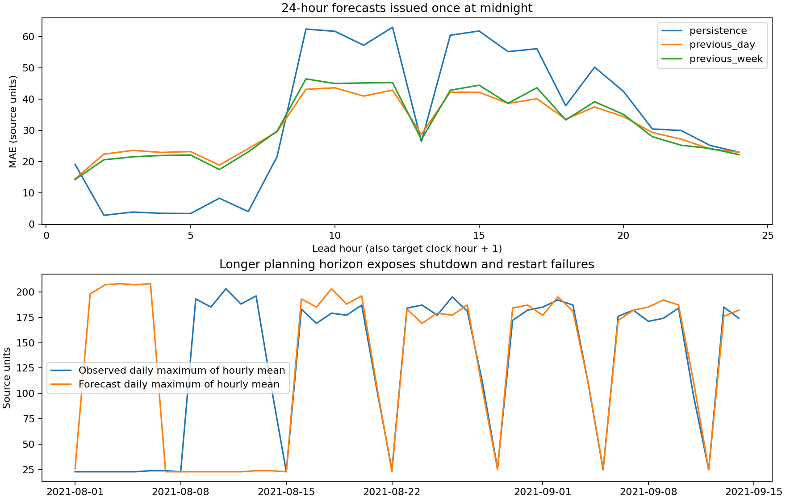

# 17차: 한 시점에서 다음 24시간을 예측하는 계획용 기능

과제의 ‘향후 지정된 시간구간’과 일정 조정 요구를 준비하기 위해 **자정 시작 전, 전날 23시 관측까지 받고 다음 24시간을 동시에 예측**하는 기능을 추가했다. 공식 지정 구간은 미확인이며 24시간은 운영계획용 시범 설정이다. 기존 한 시간 예측과 달리 하루 중 새 실측값을 받아 입력을 갱신하지 않는다. 한 시간 순차 예측 MAE 4.904와 직접 성능 비교할 수 없다.

입력은 시작 시점까지의 55개 특징에 전일·전주의 해당 24시간 평균과 15분 최대값 모양 96개를 더한 151개다. 55개만 사용하는 초기 후보도 기록했다. 평균 24개와 시간별 15분 최대값 24개는 별도 모델로 직접 예측한다. 학습에 쓰는 각 행의 마지막 정답(`시작+23시간`)이 검증 시작보다 과거인지 확인한다. 예를 들어 8월 평가 학습의 마지막 시작 시각은 7월 31일 00시, 마지막 정답은 7월 31일 23시다.

4~6월 매일 자정 예측을 평가하고 월별 MAE를 같은 비중으로 평균해 선택했다. 기준선도 정확히 같은 날짜·목표 시간·관측 종료 시점을 쓴다.

| 후보 | 4~6월 선택 MAE |
|---|---:|
| 직전 시간 유지 | 40.783 |
| 전일 같은 시간 | 39.653 |
| **전주 같은 시간** | **17.909** |
| 55개 입력 ExtraTrees 잎 2 | 28.928 |
| 55개 입력 ExtraTrees 잎 8 | 28.003 |
| 과거 하루 모양 추가, 잎 2 | 23.046 |
| 과거 하루 모양 추가, 잎 8 | 22.069 |
| 과거 하루 모양 + 전주 대비 잔차, 잎 8 | 23.691 |

처음에는 55개 입력만 비교했다. 검증에서 기준선보다 크게 나빠 모델에도 기준선과 같은 과거 하루 모양을 제공하는 비교를 추가했다. 추가 전 계획을 갱신하고 초기 선택·검증·요약을 `initial_pass/`에 보존했다. 초기 8~9월 결과까지 이미 출력한 뒤 보강했으므로 이 과정의 회고적 성격을 명시한다. 추가 후보도 전주 기준을 이기지 못해 **하루 계획용 기능은 전주 기준을 선택**했다. 하루 예측 AI의 성능 우위를 입증한 것은 아니다.

선택한 방식의 7월 MAE는 6.998(유효 22일), 8~9월은 **31.521**(45일)이다. 같은 평가기간의 전일 기준은 31.275, 직전 시간 유지는 33.750이다. 8~9월에 전일이 조금 낫다는 이유로 선택을 바꾸지 않았다.

| 평가 조건 | 선택 방식 MAE |
|---|---:|
| 8월 | **42.363** |
| 9월 1~14일 | 7.515 |
| 8월 첫 주 | **83.887** |
| 8월 첫 주 이후 | 21.875 |

8월 첫 주의 저부하 기간은 전주의 가동 모양과 달라 크게 실패했다. 새 실측을 매시간 받는 한 시간 예측에서 가려졌던 **휴업·가동 계획 부재의 비용**이다. 시차별 MAE는 1시간 앞 14.244, 3시간 앞 21.533, 6시간 앞 17.444, 12시간 앞 45.289, 24시간 앞 22.222다. 자정에만 예측하므로 시차와 시간대가 겹치며, 이 값만으로 시차 증가의 순수 효과를 해석할 수 없다.

평균 전력의 일별 최대값 MAE는 46.244, 15분 최대값의 일별 최대값 MAE는 49.467이다. 15분 최대값 182 이상을 경보 대상으로 삼고 4~6월 재현율 85%를 만족하는 예측 최대값 기준 164를 고정했으나, 8~9월은 적중 76·오경보 173·미탐 47로 재현율 **61.8%**에 그쳤다. 따라서 기존 한 시간 피크 경보를 하루 경보로 교체하지 않는다.

실행은 `python3 horizon.py`다. 학습·선택·평가 후 `artifacts/day_ahead.joblib`과 JSON 이력을 생성하며 `outputs/stage17/next_day_prediction.csv`에 정답 없는 9월 15일 24시간 예측을 저장한다. 선택된 방식은 학습 계수가 없는 전주 기준이다. 같은 인터페이스가 직접·잔차 모델도 처리한다. 저장 모델만 이용하려면 `python3 horizon.py --predict-only`를 쓴다. 일별 계획용 검증과 일치하도록 예측 시작이 자정이 아니면 거부한다.

검증은 `tests/test_horizon.py`의 3개 테스트다. 마지막 학습 정답의 시간 경계, 전일·전주 기준을 포함한 미래 실측 불변성, 잔차 모델과 기준선의 실제 추론, 7월 정답이 선택·임계값에 영향을 주지 않음을 확인한다. 일별 평가와 시차별 성적은 `summary.json`, 시간별 값은 `predictions.csv`에 있다.

